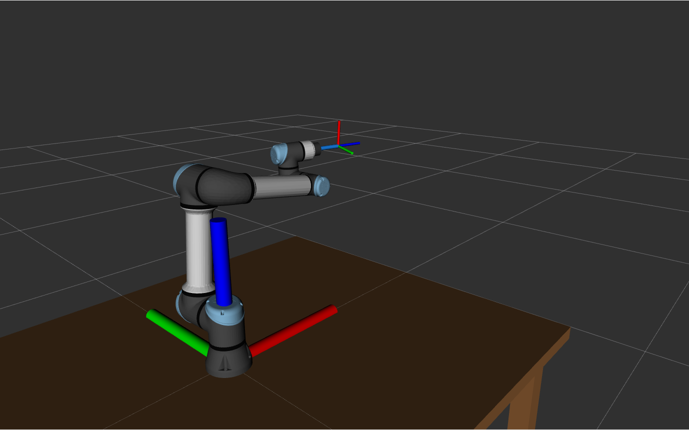

# Black Coffee Robotics · UR5e MuJoCo Cyclic Motion Take-Home Assignment

## 1. Overview

Build a **ROS2 + MuJoCo** simulation of a **Universal Robots UR5e** mounted on a
table. On a trigger that carries a set of target poses (a JSON payload), the arm
executes the moves one by one (approach, a short straight-line motion, retract),
then returns to a home configuration. The entire system must come up with a single
`docker compose up`.

This task spans scene authoring, the MuJoCo ↔ ROS2 bridge, motion planning
(MoveIt2), a trigger/state-machine, and containerization. You are expected to
**integrate existing packages** (the UR description, a MuJoCo–ROS2 bridge,
`ros2_control`, MoveIt2 configs), not build them from scratch. Suggested starting
points are listed in §6.

## 2. Task specifics

### 2.1 Scene
- UR5e (Menagerie model) mounted on a table.
- Table dimensions: **2.0 × 1.5 × 1.0 m** (length × width × height; the table top is
  1.0 m above the floor). The robot base is mounted at the **center of the table
  top**. The table may be modelled as a simple box.
- **Mounting:** the arm is bolted **upright** on the table top, no tilt:
  `base_link` Z points **up** and `base_link` faces the longer (2.0 m) edge.
- **Frames:** `base_link` is the base mounting frame; its origin is the mounting
  point and the table top surface is `z = 0`. Every target pose is expressed in
  `base_link`, and all targets are above the table (`z > 0`). Table placement in the
  MuJoCo *world* frame is your choice, but you must publish a correct TF tree
  `world → base_link → … → tool0 → ee_link`.

`sample_image.png` shows the expected scene (UR5e on the table, with the `base_link`
frame at the mounting point) for a rough sanity check.



### 2.2 End-effector tool (`ee_link`)

- Attach a **thin cylinder** rigidly to the tool flange (`tool0`), extending along the
  tool's approach axis (`tool0` +Z). Use these **fixed dimensions**: radius
  **12 mm (0.012 m)** and length **120 mm (0.12 m)**. Do not change them.
- Define **`ee_link`** at the **tip** of the cylinder (i.e. **0.12 m from `tool0`
  along +Z**) with the same orientation as `tool0`. Add it to both the MuJoCo model
  and the URDF/SRDF so it is part of the kinematic chain and the MoveIt2 planning group.
- **Plan in `ee_link`:** inverse kinematics (IK) and straight-line planning use
  `ee_link` as the end-effector / planning frame. Every task pose (`approach`, the
  linear endpoint) and `/tcp_pose` therefore refers to `ee_link`, not `tool0`.
- Treat the cylinder as part of the robot for collision checking, so approach, linear
  travel, and retract remain collision-free with the tool attached.

### 2.3 Bridge & visualization
- Setup the MuJoCo simulation and bridge it to ROS2:
  - publish `/joint_states` from the simulated joints;
  - **drive the simulated joints from your controller** (e.g. `ros2_control` /
    MoveIt2 trajectory execution);
  - publish `/clock` and run all nodes with `use_sim_time:=true` so ROS and MuJoCo
    share a single clock.
- **RViz** (robot model + TF) and the **MuJoCo viewer** must both launch
  automatically on `docker compose up`.

### 2.4 Trigger & motion
- Subscribe to **`/start`** (`std_msgs/String`); the message `data` is the JSON poses
  to run (see §2.7). The actual poses arrive in this message, so **do not hardcode**
  the sample numbers. On receipt, run **one full cycle** over them.
- For **each move**, in order, perform three segments:
  1. **Approach:** a collision-free **free-space** motion to the move's `approach`
     pose (position + orientation).
  2. **Linear travel:** from the approach pose, move the TCP in a **straight line**
     along `direction` for `distance` meters, holding orientation constant.
  3. **Retract:** move the TCP in a **straight line** back along the same path to
     the approach pose, holding orientation constant.

  The linear travel and retract are straight-line moves; only the approach is
  free-space.
- **Collision-free everywhere:** every segment (approach, linear travel, and
  retract) must be self-collision and environment-collision (the table) aware and
  avoidant. Load the table into the MoveIt2 planning scene.
- **Do not change the robot's physical model.** The mesh files, joint / velocity /
  acceleration / effort limits, link lengths, and any other physical parameters from
  the provided UR5e URDF/Xacro and MuJoCo model must stay exactly as given. Plan and
  execute within the limits; do not loosen them to make a motion succeed.
  **Controller / actuator gain tuning is allowed** where it helps tracking.
- **Failure handling:** if **any** segment of a move fails for **any** reason
  (unreachable, no plan found, would collide, execution error), abandon that move and
  proceed to the **next pose's approach**. Do not abort the cycle.
- **Timing:** each pose (its full approach + linear + retract) must complete in
  **< 30 s of wall-clock time**.
- After the last move, return to a defined **home** configuration (your choice;
  document it in your README).
- The cycle is **idempotent**: a new `/start` runs it again cleanly from home.

### 2.5 Reporting topics
Your system **must** publish:

| Topic | Type | Meaning |
|---|---|---|
| `/joint_states` | `sensor_msgs/JointState` | joint positions (for RViz/TF) |
| `/tcp_pose` | `geometry_msgs/PoseStamped` | current TCP pose in `base_link`, ≥ 20 Hz |
| `/cycle_status` | `std_msgs/String` | one of `ready` \| `running` \| `completed` |
| `/attempted_count` | `std_msgs/Int32` | number of moves **attempted** this cycle (+1 when a move begins) |
| `/completed_count` | `std_msgs/Int32` | number of moves **successfully completed** this cycle (+1 only when a move finishes every segment without failure) |
| `/motion_state` | `std_msgs/String` | current end-effector motion phase: `idle` \| `approach` \| `linear` \| `retract` |

Status lifecycle (exactly these three values):
- **`ready`:** on startup, once the system can accept a pose set.
- **`running`:** from receipt of `/start` until the cycle ends.
- **`completed`:** after the cycle ends (all poses attempted and the robot returned
  home); it stays `completed` and will accept another `/start`, which returns it to
  `running`.

Both `/attempted_count` and `/completed_count` reset to 0 at the start of each cycle.

**Motion state** (`/motion_state`) is reported **at all times**, in addition to (not
instead of) `/cycle_status`, and names the current end-effector motion phase:
- **`idle`:** not executing a segment (at home / between cycles).
- **`approach`:** free-space motion to a move's approach pose.
- **`linear`:** straight-line travel out along `direction`.
- **`retract`:** straight-line travel back to the approach pose.

The end-of-cycle return to home is reported as `approach` while moving, then `idle`
once home is reached.

### 2.6 Interface, networking & QoS

**Trigger + payload:** publish `std_msgs/String` on `/start` whose `data` is the
**JSON contents** of a coordinates set (schema in §2.7). On receipt, parse it and run
one full cycle over those moves. There is no file to mount; the poses arrive in the
trigger message.

**TCP frame:** a thin cylindrical tool is rigidly attached at the UR5e tool flange
(`tool0`), and `ee_link` is defined at the **tip** of that cylinder. `ee_link` is the
TCP for this task: MoveIt2 plans for `ee_link`, and `/tcp_pose` is the pose of
`ee_link` expressed in `base_link`. See §2.2.

**Networking:**
- ROS2 topics **must be reachable from the host** (outside the container): run the
  container with `network_mode: host`, or otherwise expose DDS discovery. Our
  evaluator runs on the host and must see your topics.
- Set a **fixed `ROS_DOMAIN_ID=42`** and
  **`RMW_IMPLEMENTATION=rmw_cyclonedds_cpp`** (Cyclone DDS) in `docker-compose.yml`;
  the evaluator uses the same values so host and container discover each other.

**QoS:**
- **`/start`:** **Reliable + Transient Local** (latched, depth 1), so the trigger is
  never missed even if your subscriber starts late.
- **Reporting topics** (`/tcp_pose`, `/cycle_status`, `/motion_state`,
  `/attempted_count`, `/completed_count`): **Best Effort**, and **published
  continuously** (status, motion state, and counts at ≥ 5 Hz, not only on change) so
  a subscriber always sees the latest value.
- `/joint_states`: no QoS constraint; use whatever your bridge/controller stack
  publishes.

### 2.7 Coordinate file format

All values are in the `base_link` frame, SI units (meters, radians). Orientation is
a quaternion `[x, y, z, w]` (**w last**). `direction` need not be unit length (it
will be normalized); `distance` is in meters. See `test_case_1.json` for a full
example.

```json
{
  "frame_id": "base_link",
  "moves": [
    {
      "id": 1,
      "approach": {
        "position": [0.40, 0.00, 0.30],
        "orientation": [1.0, 0.0, 0.0, 0.0]
      },
      "linear": {
        "direction": [0.0, 0.0, -1.0],
        "distance": 0.10
      }
    }
  ]
}
```

**Semantics of one move:** bring the TCP to `approach.position` with
`approach.orientation`; translate the TCP from `approach.position` to
`approach.position + normalize(direction) * distance` along a straight line; then
retract straight back to `approach.position`. Keep orientation equal to
`approach.orientation` throughout the linear travel and retract.

## 3. Hard stack requirements

These are **hard requirements**. A submission that swaps any of them out will not be
evaluated:

| Component | Requirement |
|---|---|
| Simulator | **MuJoCo** (use the UR5e model from [MuJoCo Menagerie](https://github.com/google-deepmind/mujoco_menagerie)) |
| Middleware | **ROS2 Humble** (Ubuntu 22.04) |
| Motion | **MoveIt2** (use it for all motion planning and inverse kinematics) |
| Deployment | **Docker**: a single `docker compose up` brings up the full system |

## 4. Deliverables

A **git repository** containing:
- All source (your ROS2 package(s), MuJoCo scene/assets, MoveIt2 config).
- `Dockerfile`(s) and a `docker-compose.yml`.
- A `README.md` with: how to build, how to run, your chosen **home** configuration,
  and how to trigger a cycle (publish a poses JSON on `/start`).

**Build & run (must work verbatim from a clean checkout):**

```bash
docker compose build
docker compose up
```

Bringing up the full system (MuJoCo + bridge + your node + RViz) must require **no
manual steps** beyond these two commands.

## 5. How we evaluate

We publish the contents of a pose file (schema per §2.7) on `/start` and observe your
reporting topics. We evaluate against **several pose sets, including ones not shared
with you**, so build to the interface and thresholds, not to the sample numbers.

For each move, the TCP motion (measured from `/tcp_pose`) is scored against:

- **Approach pose reached:** position within **1 cm**, orientation within **~3°**
  (0.05 rad).
- **Linear endpoint reached:** within **1 cm** of
  `approach + normalize(direction) · distance`.
- **Path straightness:** max perpendicular deviation from the ideal line ≤ **5 mm**.
- **Orientation held** during the linear travel: within **~3°**.
- **Order respected:** moves are executed in array order; `/attempted_count` and
  `/completed_count` reflect attempts and successes respectively.
- **Timing:** each pose completes in **< 30 s of wall-clock time**, and every
  segment (approach, travel, retract) is collision-free.
- **Robustness:** any single move's failure skips to the next pose (not fatal); the
  robot returns home; `/cycle_status` ends at `completed`; a second `/start` re-runs
  cleanly.
- **Motion quality:** shorter and smoother paths are preferred (avoid needless
  detours or jerky reconfigurations).

What we value, in order:
1. **Bring-up & observability:** it works end-to-end and its status, motion-state,
   pose, and count topics behave correctly.
2. **Accuracy of motion:** approach + genuinely straight travel with held
   orientation, within the tolerances above.
3. **Success rate across varied datasets** under the stated constraints (including
   pose sets not shared with you).
4. **Motion quality:** shorter, smoother paths are preferred.

We do **not** need: custom GUIs, exhaustive unit tests, or hand-rolled IK/planners
(use MoveIt2). Budget **~8–12 hours**.

**AI tools:** you may freely use web search, Claude Code / Copilot, and other LLM
assistants during development.

## 6. Starter resources

- **MuJoCo ↔ ROS2 bridge:** <https://github.com/moveit/mujoco_ros2_control>. The
  `ros2_control` plugin for MuJoCo, with examples for wiring ROS2 to MuJoCo.
- **Robot models:** <https://github.com/google-deepmind/mujoco_menagerie>. MuJoCo
  models for many popular robots, including the UR5e (`universal_robots_ur5e`).
